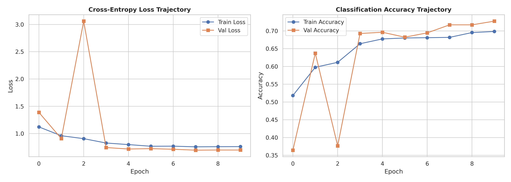
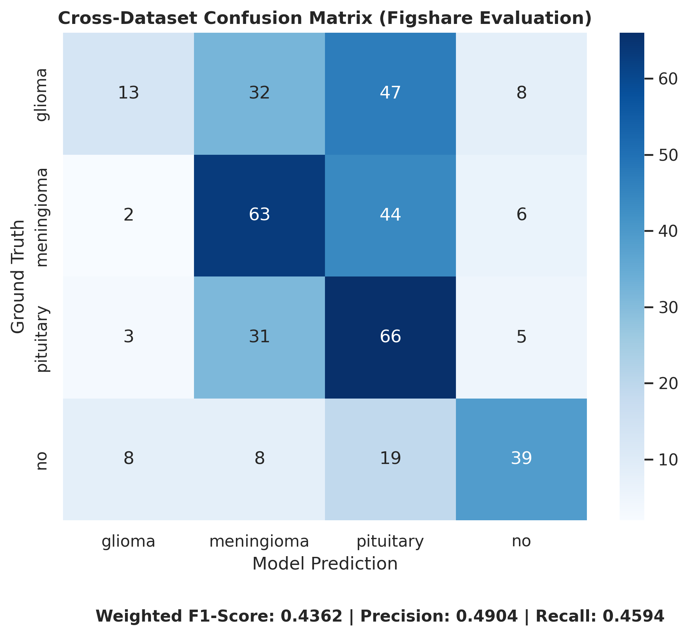

# Attention-Driven Multi-Branch CNN for Cross-Dataset Brain Tumor Classification

## 📌 Abstract

This repository presents an experimental deep learning framework for multi-class brain tumor classification across heterogeneous MRI acquisition protocols. We introduce a **Tri-Branch Attention Convolutional Neural Network (TBA-CNN)** that processes localized structural features and global spatial context in parallel, fusing them via a **Convolutional Block Attention Module (CBAM)**.

To evaluate out-of-distribution performance and clinical viability, models were trained on the **BRISC** MRI dataset and subjected to zero-shot cross-dataset evaluation on the **Figshare** dataset. Our experiments highlight the impact of acquisition-induced domain shift on medical AI systems, specifically quantifying inter-class confusion between *Meningioma* and *Pituitary* pathologies across institutional boundaries.

---

## 🏗️ Architectural Overview

Standard sequential CNN architectures often trade off localized feature resolution for macroscopic receptive field coverage. TBA-CNN resolves this by deploying two parallel feature extraction pathways prior to attention fusion:

<pre>
                      ┌──────────────────────────────────────────┐
                      │              Input MRI Scan              │
                      │               (3 x 224 x 224)            │
                      └────────────────────┬─────────────────────┘
                                           │
                    ┌──────────────────────┴──────────────────────┐
                    │                                             │
                    ▼                                             ▼
        ┌───────────────────────┐                     ┌───────────────────────┐
        │       Branch 1        │                     │       Branch 2        │
        │ Local Feature Extractor│                    │ Global Context Extractor│
        │  Standard 3x3 Convs   │                     │ Dilated Convs (rate=2)│
        └───────────┬───────────┘                     └───────────┬───────────┘
                    │                                             │
                    └──────────────────────┬──────────────────────┘
                                           │
                                     Concatenation
                                     (128 Channels)
                                           │
                                           ▼
                                ┌─────────────────────┐
                                │     CBAM Module     │
                                │ • Channel Attention │
                                │ • Spatial Attention │
                                └──────────┬──────────┘
                                           │
                                           ▼
                                ┌─────────────────────┐
                                │ Global Average Pool │
                                └──────────┬──────────┘
                                           │
                                           ▼
                                ┌─────────────────────┐
                                │ Classifier / FC Head│
                                └─────────────────────┘
</pre>

### Key Components

* **Branch 1 (Local Feature Extraction):** A 3-layer convolutional network using standard **3x3** kernels to isolate localized edge boundaries, tissue densities, and micro-textures.
* **Branch 2 (Global Context Extraction):** A 3-layer convolutional network using dilated convolutions (dilation rate = 2) to expand the receptive field without increasing parameter count, capturing macro spatial relationships between the lesion and healthy brain structures.
* **Attention Fusion (CBAM):** Sequential Channel Attention (deciding *what* features are salient) and Spatial Attention (deciding *where* in the image to focus), suppressing irrelevant skull pixels and scanner background noise.

---

## 🔬 Experimental Setup & Datasets

| Parameter | Configuration |
| :--- | :--- |
| **Primary Dataset (In-Domain)** | BRISC (80% Train / 20% Validation split) |
| **Secondary Dataset (Out-of-Domain)** | Figshare (Held-out Cross-Dataset Test set) |
| **Target Classes (4)** | `glioma_tumor`, `meningioma_tumor`, `pituitary_tumor`, `no_tumor` |
| **Optimizer** | Adam (beta1=0.9, beta2=0.999, initial lr = 0.001) |
| **Learning Rate Schedule** | StepLR (step_size=3, gamma=0.1) |
| **Loss Function** | Categorical Cross-Entropy Loss |
| **Batch Size & Epochs** | Batch Size: 16 | Epochs: 10 |
| **Hardware** | NVIDIA Tesla T4 GPU (Google Colab Environment) |

---

## 📊 Results & Domain Shift Analysis

### In-Domain Performance (BRISC Split)
During training on the primary dataset, the network converged smoothly, achieving ~73% validation accuracy.

### Zero-Shot Cross-Dataset Evaluation (Figshare Split)
When evaluated on unseen MRI scans from the Figshare dataset, the overall weighted F1-score shifted to **0.3899** (Accuracy: **40.61%**). 

#### Per-Class Performance Breakdown

| Pathology Class | Precision | Recall | F1-Score | Support |
| :--- | :--- | :--- | :--- | :--- |
| **Glioma** | 0.5769 | 0.1500 | 0.2381 | 100 |
| **Meningioma** | 0.4035 | 0.4000 | 0.4017 | 115 |
| **Pituitary** | 0.3260 | 0.5619 | 0.4126 | 105 |
| **No Tumor** | 0.5479 | 0.5405 | 0.5442 | 74 |
| **Macro Average** | **0.4636** | **0.4131** | **0.3992** | **394** |
| **Weighted Average** | **0.4540** | **0.4061** | **0.3899** | **394** |

#### Research Insights
1. **Inter-Class Confusion:** The confusion matrix reveals a pronounced diagnostic confusion between *Meningioma* and *Pituitary* tumors (59 instances misclassified). This suggests that variations in contrast intensity between different scanner vendors heavily impact feature maps learned by non-adapted convolution layers.
2. **Clinical Implications:** High validation performance within a single site does not guarantee out-of-distribution reliability. Future extensions require domain adaptation techniques (e.g., Maximum Mean Discrepancy alignment or Test-Time Adaptation) to normalize inter-hospital variance.

---

## 📁 Repository Structure

<pre>
brain-tumor-tba-cnn/
├── notebooks/
│   └── Brain_Tumor_Classification.ipynb          # End-to-end executable notebook
├── models/
│   └── tba_cnn_brain_tumor.pth      # Serialized PyTorch model weights
├── results/
│   ├── training_curves.png          # Loss and accuracy trajectory plots
│   ├── cross_dataset_confusion_matrix.png  # Evaluation confusion matrix
│   └── classification_report.csv    # Detailed per-class metrics output
├── requirements.txt                 # Dependencies and environment specs
└── README.md                        # Project documentation
</pre>

---

## 🛠️ Reproduction & Quick Start

### 1. Clone the Repository
<pre>
git clone https://github.com/imajidhussain/brain-tumor-tba-cnn.git
cd brain-tumor-tba-cnn
</pre>

### 2. Install Dependencies
<pre>
pip install -r requirements.txt
</pre>

### 3. Run Pipeline
Open `notebooks/main_pipeline.ipynb` in Google Colab or a local Jupyter environment. The code programmatically clones the target datasets, executes dataset partitioning, and performs network training.

---
